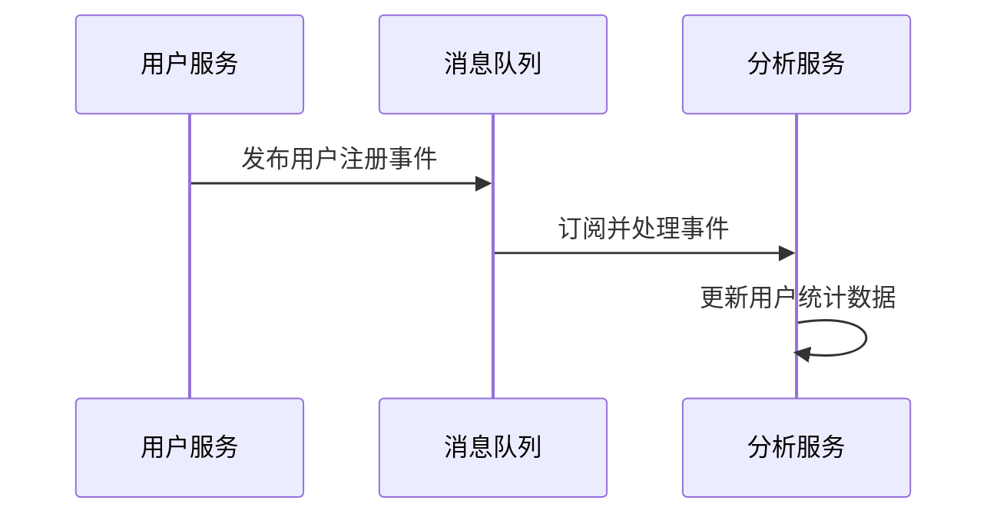

# 四会培训平台 - 微服务架构设计方案

**文档版本**: 1.0  
**创建日期**: 2025-06-18  
**设计师**: 系统架构师  
**审核状态**: 待审核  

## 1. 概述

### 1.1 设计目标
- **可扩展性**: 各服务可独立扩展，满足不同业务模块的性能需求
- **可维护性**: 模块化设计，降低系统复杂度，提高开发效率
- **可靠性**: 服务间解耦，避免单点故障，提高系统整体稳定性
- **灵活性**: 支持敏捷开发，新功能快速上线
- **技术多样性**: 不同服务可选择最适合的技术栈

### 1.2 现状分析
当前系统采用单体架构，所有功能模块部署在一个Spring Boot应用中。随着业务发展，面临以下挑战：
- 部署风险高，单个模块问题影响整个系统
- 扩展粒度粗，无法针对热点功能独立扩展
- 技术栈固化，难以引入新技术
- 团队协作效率低，代码冲突频繁

## 2. 微服务划分策略

### 2.1 服务划分原则

#### 业务边界清晰
- 按业务功能划分，确保单一职责
- 最小化服务间数据依赖
- 保持数据一致性边界

#### 技术独立性
- 每个服务独立选择技术栈
- 独立的数据存储和管理
- 独立的部署和发布周期

#### 团队自治
- 每个服务由专门团队负责
- 端到端的开发和运维责任
- 最小化团队间协调成本

### 2.2 微服务列表

#### 2.2.1 核心业务服务

##### 1️⃣ 用户服务 (User Service)
**职责范围**:
- 用户注册、登录、注销
- 用户信息管理和权限控制
- JWT Token生成和验证
- 角色和权限管理(RBAC)

**数据模型**:
- users, roles, user_roles表
- 权限配置和缓存

**技术栈**:
- Spring Boot + Spring Security
- MySQL + Redis
- JWT认证

**API端点**:
```
POST /api/users/auth/login
POST /api/users/auth/logout
GET  /api/users/profile
PUT  /api/users/profile
POST /api/users/register
GET  /api/users/permissions
```

##### 2️⃣ 问卷服务 (Questionnaire Service)
**职责范围**:
- 问卷设计和创建
- 问卷模板管理
- 问卷发布和收集
- 答题数据存储

**数据模型**:
- questionnaires, questions, question_options表
- questionnaire_responses, answers表

**技术栈**:
- Spring Boot + Spring Data JPA
- MySQL + Redis缓存
- 异步消息处理

**API端点**:
```
POST /api/questionnaires
GET  /api/questionnaires/{id}
PUT  /api/questionnaires/{id}
POST /api/questionnaires/{id}/submit
GET  /api/questionnaires/{id}/responses
```

##### 3️⃣ AI服务 (AI Service)
**职责范围**:
- AI聊天对话管理
- 知识增强对话
- 聊天会话和历史记录
- 外部AI接口集成

**数据模型**:
- chat_sessions, chat_messages表
- AI配置和模型管理

**技术栈**:
- Spring Boot + WebSocket
- MySQL + Redis
- DeepSeek API集成

**API端点**:
```
POST /api/ai/chat/send
GET  /api/ai/chat/sessions
POST /api/ai/chat/knowledge
WebSocket /ws/chat
```

##### 4️⃣ 知识库服务 (Knowledge Service)
**职责范围**:
- 文档上传和管理
- 文本内容解析
- 知识检索和搜索
- 文档分类和标签

**数据模型**:
- documents表
- 全文检索索引

**技术栈**:
- Spring Boot + Elasticsearch
- MySQL + 文件存储(OSS)
- TF-IDF算法

**API端点**:
```
POST /api/knowledge/documents
GET  /api/knowledge/search
GET  /api/knowledge/documents/{id}
DELETE /api/knowledge/documents/{id}
```

##### 5️⃣ 内容管理服务 (Content Service)
**职责范围**:
- 培训内容发布
- 多媒体文件管理
- 内容分类和检索
- 版本控制

**数据模型**:
- contents, categories表
- 文件元数据管理

**技术栈**:
- Spring Boot + Spring Data JPA
- MySQL + OSS存储
- CDN加速

**API端点**:
```
POST /api/contents
GET  /api/contents
PUT  /api/contents/{id}
POST /api/contents/upload
```

##### 6️⃣ 数据分析服务 (Analytics Service)
**职责范围**:
- 问卷数据统计分析
- 报表生成和导出
- 数据可视化
- 用户行为分析

**数据模型**:
- 统计汇总表
- 分析结果缓存

**技术栈**:
- Spring Boot + Apache POI
- MySQL + Redis
- 数据分析引擎

**API端点**:
```
GET  /api/analytics/questionnaire/{id}/stats
POST /api/analytics/reports/generate
GET  /api/analytics/dashboard
```

#### 2.2.2 基础设施服务

##### 7️⃣ 网关服务 (Gateway Service)
**职责范围**:
- 统一API入口
- 路由和负载均衡
- 认证和授权
- 限流和熔断

**技术栈**:
- Spring Cloud Gateway
- Redis + Lua脚本
- 监控和链路追踪

##### 8️⃣ 配置中心 (Config Service)
**职责范围**:
- 集中配置管理
- 配置动态更新
- 环境隔离
- 配置版本控制

**技术栈**:
- Spring Cloud Config
- Git仓库
- 加密配置支持

##### 9️⃣ 监控服务 (Monitoring Service)
**职责范围**:
- 系统性能监控
- 安全事件监控
- 日志收集和分析
- 告警通知

**技术栈**:
- Prometheus + Grafana
- ELK Stack
- 自定义监控组件

## 3. 服务间通信设计

### 3.1 通信协议选择

#### 同步通信 - REST API
**使用场景**: 
- 实时性要求高的业务操作
- 简单的CRUD操作
- 用户界面交互

**技术实现**:
- HTTP/HTTPS + JSON
- OpenAPI 3.0规范
- 统一错误处理

**示例**:
```yaml
# 用户服务调用权限检查
GET /api/users/{userId}/permissions
Authorization: Bearer {jwt_token}
```

#### 异步通信 - 消息队列
**使用场景**:
- 事件驱动的业务流程
- 数据同步和解耦
- 高吞吐量场景

**技术实现**:
- RabbitMQ或Apache Kafka
- 事件溯源模式
- 消息重试和死信队列

**示例**:
```json
{
  "eventType": "USER_REGISTERED",
  "userId": 12345,
  "timestamp": "2025-06-18T10:00:00Z",
  "data": {
    "username": "newuser",
    "email": "user@example.com"
  }
}
```

#### 实时通信 - WebSocket
**使用场景**:
- AI聊天实时对话
- 实时通知推送
- 在线协作功能

### 3.2 服务发现和注册

#### Kubernetes原生服务发现
```yaml
apiVersion: v1
kind: Service
metadata:
  name: user-service
spec:
  selector:
    app: user-service
  ports:
    - port: 8080
      targetPort: 8080
```

#### 服务注册中心 (可选)
- Eureka Server
- Consul
- Nacos

### 3.3 负载均衡策略

#### 客户端负载均衡
- Spring Cloud LoadBalancer
- Ribbon (已停止维护)

#### 服务端负载均衡
- Kubernetes Service
- Nginx/Envoy代理

## 4. 数据管理策略

### 4.1 数据库设计原则

#### 服务独享数据库
每个微服务拥有独立的数据存储，避免数据库层面的紧耦合。

#### 数据一致性处理
**最终一致性**: 通过事件驱动实现数据同步
**强一致性**: 使用分布式事务(Saga模式)

### 4.2 数据库分配方案

| 服务 | 数据库类型 | 数据表 |
|-----|----------|-------|
| 用户服务 | MySQL | users, roles, user_roles |
| 问卷服务 | MySQL | questionnaires, questions, responses |
| AI服务 | MySQL + Redis | chat_sessions, chat_messages |
| 知识库服务 | MySQL + Elasticsearch | documents, document_index |
| 内容服务 | MySQL + OSS | contents, categories |
| 分析服务 | MySQL + Redis | analytics_data, reports |

### 4.3 数据同步策略

#### 事件发布/订阅模式


#### 数据变更日志 (CDC)
- Debezium + Kafka
- MySQL Binlog监听
- 实时数据同步

## 5. 安全架构设计

### 5.1 认证和授权

#### 统一认证流程
1. 用户通过网关登录
2. 网关调用用户服务验证
3. 返回JWT Token
4. 后续请求携带Token访问各服务

#### 服务间认证
- 服务到服务的mTLS通信
- 内部JWT Token验证
- API Key机制

### 5.2 数据安全

#### 传输加密
- 所有服务间通信使用HTTPS/TLS
- 敏感数据端到端加密

#### 存储加密
- 数据库字段级加密
- 密钥管理服务(KMS)

### 5.3 网络安全

#### 网络隔离
```yaml
# Kubernetes NetworkPolicy示例
apiVersion: networking.k8s.io/v1
kind: NetworkPolicy
metadata:
  name: user-service-policy
spec:
  podSelector:
    matchLabels:
      app: user-service
  ingress:
  - from:
    - podSelector:
        matchLabels:
          app: gateway-service
```

## 6. 部署架构设计

### 6.1 容器化策略

#### Docker镜像规范
```dockerfile
# 多阶段构建示例
FROM openjdk:17-jdk-slim as builder
WORKDIR /app
COPY . .
RUN ./mvnw package -DskipTests

FROM openjdk:17-jre-slim
WORKDIR /app
COPY --from=builder /app/target/*.jar app.jar
EXPOSE 8080
ENTRYPOINT ["java", "-jar", "app.jar"]
```

#### 镜像管理
- 私有镜像仓库(Harbor)
- 镜像扫描和安全检查
- 分层缓存优化

### 6.2 Kubernetes部署

#### 部署文件结构
```
k8s/
├── namespaces/
├── services/
│   ├── user-service/
│   ├── questionnaire-service/
│   └── ...
├── configmaps/
├── secrets/
└── ingress/
```

#### 资源配置示例
```yaml
apiVersion: apps/v1
kind: Deployment
metadata:
  name: user-service
spec:
  replicas: 3
  selector:
    matchLabels:
      app: user-service
  template:
    metadata:
      labels:
        app: user-service
    spec:
      containers:
      - name: user-service
        image: sihui/user-service:v1.0.0
        ports:
        - containerPort: 8080
        resources:
          requests:
            memory: "256Mi"
            cpu: "250m"
          limits:
            memory: "512Mi"
            cpu: "500m"
        env:
        - name: SPRING_PROFILES_ACTIVE
          value: "k8s"
        - name: DB_HOST
          valueFrom:
            configMapKeyRef:
              name: user-service-config
              key: db.host
```

### 6.3 服务网格 (可选)

#### Istio集成
- 流量管理和路由
- 安全策略和mTLS
- 可观测性和监控

## 7. 监控和观测

### 7.1 指标监控

#### 应用指标
- JVM内存和GC
- HTTP请求延迟和错误率
- 数据库连接池状态
- 缓存命中率

#### 业务指标
- 用户活跃度
- 问卷提交率
- AI对话成功率

### 7.2 日志管理

#### 结构化日志
```json
{
  "timestamp": "2025-06-18T10:00:00Z",
  "level": "INFO",
  "service": "user-service",
  "traceId": "abc123",
  "spanId": "def456",
  "message": "User login successful",
  "userId": 12345
}
```

#### 日志聚合
- ELK Stack部署
- 日志收集和分析
- 异常检测和告警

### 7.3 链路追踪

#### 分布式追踪
- Spring Cloud Sleuth
- Zipkin或Jaeger
- 跨服务调用链分析

## 8. 迁移策略

### 8.1 渐进式迁移

#### 阶段一: 基础设施准备 (2周)
- Kubernetes集群搭建
- CI/CD流水线建设
- 监控体系部署
- 服务网格配置

#### 阶段二: 核心服务拆分 (4-6周)
- 用户服务独立部署
- 网关服务配置
- 数据库拆分和迁移
- 认证机制调整

#### 阶段三: 业务服务拆分 (6-8周)
- 问卷服务拆分
- AI服务独立化
- 知识库服务迁移
- 内容管理服务拆分

#### 阶段四: 优化和完善 (4周)
- 性能调优
- 监控完善
- 安全加固
- 文档完善

### 8.2 风险控制

#### 灰度发布
- 金丝雀部署策略
- 蓝绿部署机制
- 自动回滚机制

#### 数据一致性保障
- 数据备份和恢复
- 双写机制验证
- 数据校验工具

## 9. 性能和扩展性

### 9.1 性能目标

| 指标 | 目标值 |
|-----|-------|
| API响应时间 | P95 < 200ms |
| 系统吞吐量 | > 1000 TPS |
| 服务可用性 | 99.9% |
| 数据库连接 | < 50% 使用率 |

### 9.2 扩展策略

#### 水平扩展
- 基于CPU/内存的自动扩缩容
- 基于队列长度的扩展
- 预定义扩展规则

#### 缓存策略
- Redis分布式缓存
- 应用级缓存(Caffeine)
- CDN内容分发

## 10. 成本分析

### 10.1 资源需求评估

#### 初期部署资源
- Kubernetes集群: 3台4核8G节点
- 数据库: 2台8核16G MySQL主从
- 缓存: 2台4核8G Redis集群
- 存储: 500GB SSD + 2TB OSS

#### 年度运维成本
- 基础设施: ¥50,000
- 人力成本: ¥300,000 (2人团队)
- 第三方服务: ¥20,000
- 总计: ¥370,000

### 10.2 ROI分析
- 开发效率提升: 30%
- 系统稳定性提升: 50%
- 扩展能力增强: 100%
- 技术债务减少: 60%

## 11. 实施检查清单

### 11.1 技术准备
- [ ] Kubernetes集群就绪
- [ ] CI/CD流水线配置
- [ ] 监控系统部署
- [ ] 安全策略实施
- [ ] 数据备份机制

### 11.2 团队准备
- [ ] 微服务架构培训
- [ ] DevOps技能提升
- [ ] 团队职责分工
- [ ] 沟通协作机制

### 11.3 业务准备
- [ ] 业务影响评估
- [ ] 用户通知计划
- [ ] 应急响应预案
- [ ] 性能基线建立

## 12. 结论

本微服务架构设计方案基于现有系统特点，采用渐进式迁移策略，在保证业务连续性的前提下，逐步实现系统的现代化改造。通过合理的服务划分、标准的通信协议、完善的监控体系，将显著提升系统的可扩展性、可维护性和可靠性。

建议先从基础设施建设和核心服务拆分开始，逐步完善各项功能，确保迁移过程平稳有序。

---

**相关文档**:
- [安全需求分析报告](./SECURITY_REQUIREMENTS_ANALYSIS.md)
- [数据库设计文档](./DATABASE_DESIGN.md)
- [API设计规范](./API.md)
- [部署运维指南](./DEPLOYMENT.md) 