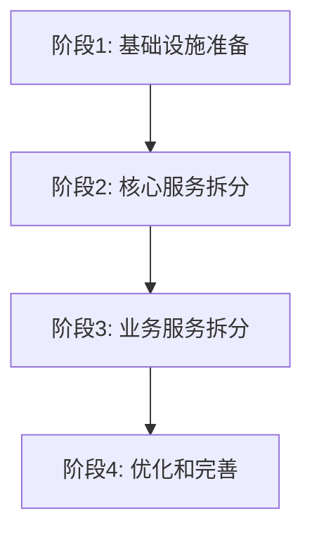
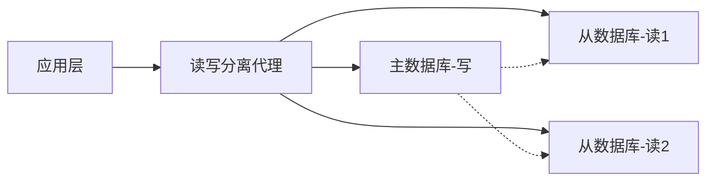
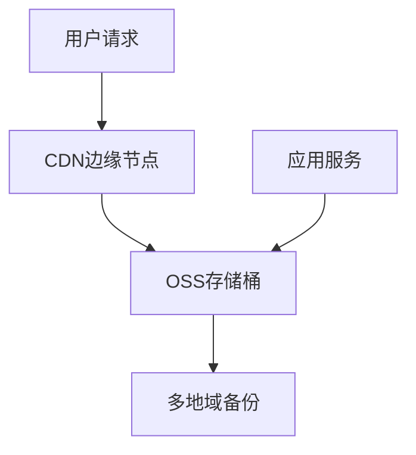

# 系统可扩展性策略

## 📋 文档概述

**文档版本**: 1.0  
**创建日期**: 2025-06-18  
**负责人**: 系统架构师  
**目标**: 为四会培训平台制定全面的可扩展性策略，确保系统能够支撑业务增长需求

## 🎯 扩展性目标

### 性能目标
- **并发用户数**: 支持10,000+在线用户
- **API响应时间**: P95 < 200ms, P99 < 500ms
- **系统吞吐量**: 1000+ TPS
- **系统可用性**: 99.9%+ (年故障时间 < 8.76小时)

### 扩展性目标
- **水平扩展**: 支持无状态服务动态扩缩
- **数据库扩展**: 支持读写分离和分库分表
- **存储扩展**: 支持云存储和CDN加速
- **地域扩展**: 支持多地域部署

## 🏗️ 当前架构分析

### 现有优势
✅ **容器化基础**: Docker Compose实现服务容器化  
✅ **缓存机制**: Redis缓存 + Spring Cache多级缓存  
✅ **数据库优化**: MySQL连接池和性能参数调优  
✅ **监控体系**: Prometheus + Grafana监控栈  
✅ **微服务设计**: 完整的微服务架构设计方案  

### 扩展性瓶颈
⚠️ **单体架构**: 当前为单体Spring Boot应用  
⚠️ **单点数据库**: 所有服务共享单一MySQL实例  
⚠️ **缺乏负载均衡**: 无应用层负载均衡机制  
⚠️ **静态资源**: 缺乏CDN和静态资源优化  
⚠️ **手动扩容**: 缺乏自动扩缩容机制  

## 📈 可扩展性策略

### 1. 应用层扩展策略

#### 1.1 微服务架构迁移
**目标**: 将单体应用拆分为独立可扩展的微服务

**实施计划**:


**服务拆分方案**:
- **用户服务** (User Service): 用户认证、授权、管理
- **问卷服务** (Survey Service): 问卷设计、发布、收集
- **AI服务** (AI Service): AI聊天、知识检索
- **内容服务** (Content Service): 培训内容管理
- **分析服务** (Analytics Service): 数据分析、报表生成
- **网关服务** (Gateway Service): API网关、路由、限流

#### 1.2 容器编排升级
**从Docker Compose迁移到Kubernetes**

**Kubernetes部署架构**:
```yaml
# 示例: 用户服务部署配置
apiVersion: apps/v1
kind: Deployment
metadata:
  name: user-service
spec:
  replicas: 3
  selector:
    matchLabels:
      app: user-service
  template:
    metadata:
      labels:
        app: user-service
    spec:
      containers:
      - name: user-service
        image: sihui/user-service:latest
        ports:
        - containerPort: 8080
        resources:
          requests:
            memory: "256Mi"
            cpu: "250m"
          limits:
            memory: "512Mi"
            cpu: "500m"
        env:
        - name: SPRING_PROFILES_ACTIVE
          value: "production"
```

#### 1.3 负载均衡策略
**多层负载均衡架构**:

1. **L4负载均衡**: 使用云负载均衡器或Nginx
2. **L7负载均衡**: API网关实现应用层负载均衡
3. **客户端负载均衡**: Spring Cloud LoadBalancer

### 2. 数据层扩展策略

#### 2.1 数据库扩展方案
**读写分离架构**:


**分库分表策略**:
- **垂直分库**: 按业务模块分离数据库
  - 用户库: users, roles, permissions
  - 问卷库: questionnaires, questions, responses
  - 内容库: contents, categories, files
  - 分析库: analytics, reports, logs

- **水平分表**: 大表数据分片
  - 聊天消息表: 按用户ID哈希分片
  - 问卷响应表: 按时间分片
  - 操作日志表: 按日期分片

#### 2.2 缓存分层策略
**三级缓存架构**:

1. **L1缓存**: 应用内存缓存 (Caffeine)
   - 热点数据: 用户权限、配置信息
   - 生存时间: 5-15分钟
   - 大小限制: 10,000条记录

2. **L2缓存**: Redis分布式缓存
   - 会话数据: JWT会话、用户状态
   - 业务缓存: 问卷数据、文档索引
   - 生存时间: 30分钟-24小时

3. **L3缓存**: CDN边缘缓存
   - 静态资源: 图片、视频、文档
   - API响应: 公开接口数据
   - 生存时间: 1小时-7天

### 3. 存储层扩展策略

#### 3.1 对象存储优化
**阿里云OSS + CDN架构**:


**存储策略**:
- **热数据**: 标准存储 + 全球CDN加速
- **温数据**: 低频访问存储 + 区域CDN
- **冷数据**: 归档存储 + 按需恢复

#### 3.2 文件处理优化
**多格式支持和转码**:
- **图片处理**: WebP格式转换、压缩优化
- **视频处理**: 多码率转码、封面提取
- **文档处理**: PDF转换、全文索引

### 4. 网络层扩展策略

#### 4.1 CDN加速策略
**全球CDN部署**:
- **静态资源**: 图片、CSS、JS文件
- **动态内容**: API响应缓存
- **视频内容**: 流媒体加速

#### 4.2 API网关架构
**功能特性**:
- **路由**: 智能路由到微服务
- **限流**: 基于用户/IP的限流策略
- **认证**: 统一JWT认证
- **监控**: API调用链追踪
- **缓存**: 响应结果缓存

### 5. 自动扩缩策略

#### 5.1 Kubernetes HPA配置
**水平Pod自动扩缩**:
```yaml
apiVersion: autoscaling/v2
kind: HorizontalPodAutoscaler
metadata:
  name: user-service-hpa
spec:
  scaleTargetRef:
    apiVersion: apps/v1
    kind: Deployment
    name: user-service
  minReplicas: 2
  maxReplicas: 10
  metrics:
  - type: Resource
    resource:
      name: cpu
      target:
        type: Utilization
        averageUtilization: 70
  - type: Resource
    resource:
      name: memory
      target:
        type: Utilization
        averageUtilization: 80
```

#### 5.2 数据库自动扩展
**云数据库弹性配置**:
- **读副本**: 根据读取负载自动增减
- **连接池**: 动态调整连接数
- **存储**: 自动扩展存储容量

## 🚀 实施路线图

### 阶段1: 基础设施升级 (4-6周)
**目标**: 建立扩展性基础

**任务清单**:
- [ ] 搭建Kubernetes集群
- [ ] 部署监控和日志系统
- [ ] 配置CI/CD流水线
- [ ] 实施API网关
- [ ] 配置CDN和对象存储

### 阶段2: 核心服务拆分 (6-8周)
**目标**: 拆分核心业务服务

**任务清单**:
- [ ] 拆分用户服务
- [ ] 拆分认证服务
- [ ] 实施服务发现
- [ ] 配置负载均衡
- [ ] 数据迁移和同步

### 阶段3: 业务服务拆分 (8-10周)
**目标**: 完成业务模块拆分

**任务清单**:
- [ ] 拆分问卷服务
- [ ] 拆分AI服务
- [ ] 拆分内容服务
- [ ] 拆分分析服务
- [ ] 完善服务间通信

### 阶段4: 优化和测试 (4-6周)
**目标**: 性能优化和压力测试

**任务清单**:
- [ ] 性能调优
- [ ] 压力测试
- [ ] 故障演练
- [ ] 监控优化
- [ ] 文档完善

## 📊 性能测试计划

### 负载测试场景
1. **正常负载**: 1000并发用户，持续30分钟
2. **峰值负载**: 5000并发用户，持续10分钟
3. **压力测试**: 10000并发用户，持续5分钟
4. **稳定性测试**: 500并发用户，持续24小时

### 监控指标
- **响应时间**: P50, P95, P99延迟
- **吞吐量**: TPS, QPS
- **资源使用**: CPU, 内存, 网络, 磁盘
- **错误率**: 4xx, 5xx错误比例

## 💰 成本估算

### 基础设施成本
- **Kubernetes集群**: ¥3,000-5,000/月
- **数据库集群**: ¥2,000-4,000/月
- **对象存储+CDN**: ¥500-1,500/月
- **监控和日志**: ¥300-800/月
- **总计**: ¥5,800-11,300/月

### ROI分析
- **开发效率提升**: 30%
- **系统稳定性提升**: 50%
- **运维成本降低**: 40%
- **预计投资回收期**: 6-12个月

## 🔧 技术选型

### 核心技术栈
- **容器编排**: Kubernetes
- **服务网格**: Istio (可选)
- **API网关**: Spring Cloud Gateway
- **配置中心**: Spring Cloud Config
- **服务发现**: Kubernetes DNS
- **负载均衡**: Nginx + Spring Cloud LoadBalancer
- **缓存**: Redis Cluster
- **数据库**: MySQL主从 + 分库分表
- **消息队列**: RabbitMQ/Apache Kafka
- **对象存储**: 阿里云OSS
- **CDN**: 阿里云CDN
- **监控**: Prometheus + Grafana
- **日志**: ELK Stack
- **链路追踪**: Jaeger

### 开发工具
- **CI/CD**: GitLab CI/Jenkins
- **镜像仓库**: Harbor
- **代码质量**: SonarQube
- **压力测试**: JMeter + K6
- **文档**: GitBook/Confluence

## 📋 风险评估与缓解

### 技术风险
1. **服务拆分复杂度**
   - 风险: 数据一致性、事务处理
   - 缓解: 分阶段迁移、数据同步策略

2. **性能回归**
   - 风险: 网络延迟、序列化开销
   - 缓解: 性能测试、监控告警

3. **运维复杂度**
   - 风险: 服务治理、故障定位
   - 缓解: 完善监控、自动化运维

### 业务风险
1. **服务中断**
   - 风险: 迁移过程中的服务不可用
   - 缓解: 蓝绿部署、回滚策略

2. **数据丢失**
   - 风险: 数据迁移过程中的数据丢失
   - 缓解: 数据备份、验证机制

## 📚 最佳实践

### 设计原则
1. **高内聚低耦合**: 服务边界清晰
2. **故障隔离**: 服务间故障不传播
3. **弹性设计**: 支持降级和熔断
4. **可观测性**: 全链路监控和追踪
5. **安全性**: 服务间认证和授权

### 开发规范
1. **API设计**: RESTful风格，版本管理
2. **错误处理**: 统一错误码和消息
3. **日志规范**: 结构化日志，链路ID
4. **测试策略**: 单元、集成、端到端测试
5. **文档维护**: API文档、运维手册

## 📈 监控和告警

### 监控体系
1. **基础监控**: 主机、网络、存储
2. **应用监控**: JVM、线程池、数据库连接
3. **业务监控**: 用户行为、业务指标
4. **日志监控**: 错误日志、异常追踪

### 告警策略
1. **分级告警**: P0-P4不同等级
2. **通知方式**: 邮件、短信、钉钉
3. **响应时间**: P0-5分钟，P1-30分钟
4. **值班机制**: 7×24小时轮班

## 🎯 成功指标

### 技术指标
- 系统可用性 > 99.9%
- API响应时间P95 < 200ms
- 系统吞吐量 > 1000 TPS
- 部署频率 > 10次/天
- 故障恢复时间 < 30分钟

### 业务指标
- 用户满意度 > 95%
- 系统容量提升 > 10倍
- 开发效率提升 > 30%
- 运维成本降低 > 40%

---

**文档维护**: 该文档需要定期更新，反映系统演进和经验总结  
**版本控制**: 所有变更需要经过技术评审和架构师批准  
**执行跟踪**: 建立项目看板，跟踪实施进度和风险  